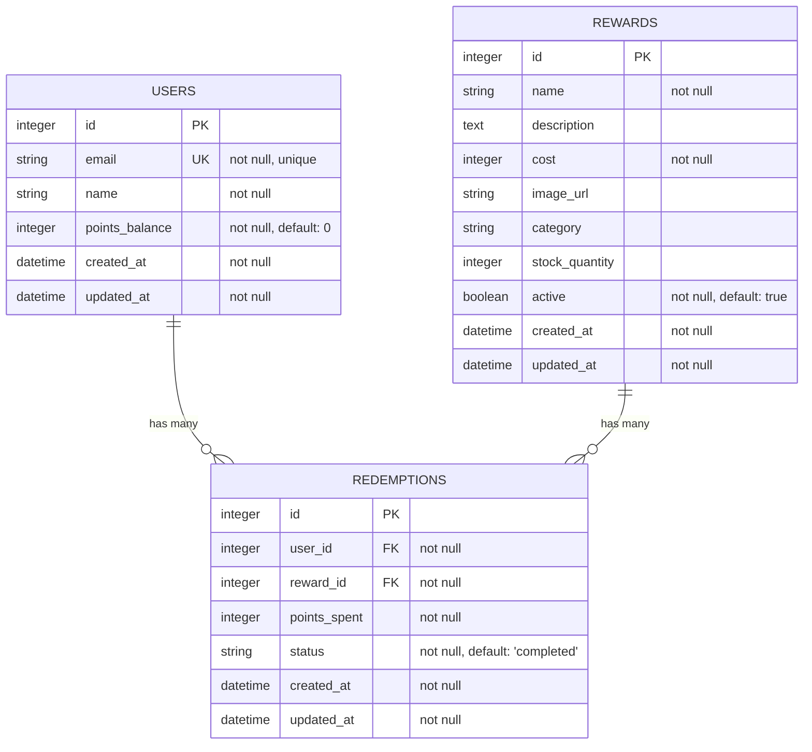

# Entity Relationship Diagram

This document describes the database schema for the Redeem-O-Matic application.

## Database Schema

## Relationships

### Users → Redemptions
- **Type**: One-to-Many
- **Cardinality**: One user can have many redemptions
- **Cascade**: When a user is deleted, all their redemptions are deleted (dependent: :destroy)
- **Foreign Key**: `redemptions.user_id` references `users.id`

### Rewards → Redemptions
- **Type**: One-to-Many
- **Cardinality**: One reward can have many redemptions
- **Cascade**: When a reward is deleted, all related redemptions are deleted (dependent: :destroy)
- **Foreign Key**: `redemptions.reward_id` references `rewards.id`

## Indexes

### Users Table
- `index_users_on_email` (unique) - on `email` column

### Rewards Table
- `index_rewards_on_active` - on `active` column

### Redemptions Table
- `index_redemptions_on_user_id` - on `user_id` column
- `index_redemptions_on_reward_id` - on `reward_id` column
- `index_redemptions_on_created_at` - on `created_at` column
- `index_redemptions_on_user_and_date` - composite index on `(user_id, created_at)`

## Constraints

### Users
- `email` must be unique and valid email format
- `name` is required
- `points_balance` must be >= 0

### Rewards
- `name` is required
- `cost` must be > 0
- `stock_quantity` must be >= 0 (can be null for unlimited stock)
- `active` defaults to true

### Redemptions
- `user_id` is required
- `reward_id` is required
- `points_spent` must be > 0
- `status` must be one of: 'pending', 'completed', 'cancelled'
- `status` defaults to 'completed'

